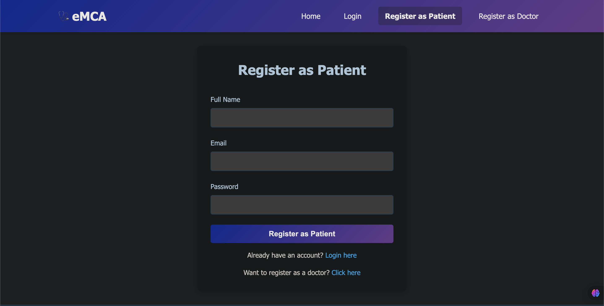
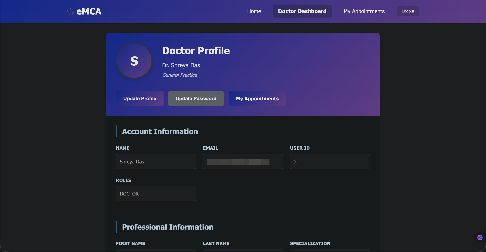

# EMCA – eMedical Care App

**Doctor Consultation / Telemedicine Web Application**

EMCA (eMedical Care App) is a full-stack telemedicine platform that enables online doctor consultations, patient and doctor registration, and secure access to electronic medical records (EMR). The system is designed with strong focus on security, data integrity, and healthcare compliance, while improving operational efficiency and patient engagement through automation.

---

## 📸 Project Screenshots

> screenshots of the entire app functionality inside a folder named `screenshots/` in the project root

### Home Page


### Patient Registration



### Doctor Dashboard



### Consultation Module


---

## 🚀 Features

* Online doctor consultation and telemedicine support
* Patient and doctor registration & profile management
* Secure authentication and authorization
* EMR (Electronic Medical Records) integration
* Consultation management workflow
* Master data transformation
* Automated email notifications
* Data integrity and compliance-focused design

---

## 🛠 Technology Stack

### Backend

* Java
* Spring Boot
* REST APIs
* JWT/Secure Authentication

### Frontend

* React.js
* HTML, CSS, JavaScript

### Database

* PostgreSQL

### Tools & IDEs

* IntelliJ IDEA (Backend)
* Visual Studio Code (Frontend)
* Git & GitHub

---

## 📂 Project Structure (Sample)

```
EMCA/
│
├── backend/              # Spring Boot Application
│   ├── src/main/java
│   ├── src/main/resources
│   └── pom.xml
│
├── frontend/             # React Application
│   ├── src/
│   ├── public/
│   └── package.json
│
├── screenshots/          # Project screenshots for README
│   ├── home.png
│   ├── patient-registration.png
│   └── doctor-dashboard.png
│
└── README.md
```

---

## ⚙️ Prerequisites

Make sure the following are installed:

* Java 17+
* Maven
* Node.js & npm
* PostgreSQL
* IntelliJ IDEA / VS Code

---

## 🗄 Database Setup (PostgreSQL)

1. Create database:

   ```sql
   CREATE DATABASE emca_db;
   ```

2. Create user (optional):

   ```sql
   CREATE USER emca_user WITH PASSWORD 'password';
   GRANT ALL PRIVILEGES ON DATABASE emca_db TO emca_user;
   ```

3. Update `application.properties` or `application.yml` in backend:

```properties
spring.datasource.url=jdbc:postgresql://localhost:5432/emca_db
spring.datasource.username=emca_user
spring.datasource.password=password
spring.jpa.hibernate.ddl-auto=update
spring.jpa.show-sql=true
```

---

## ▶️ How to Run the Project

### 1️⃣ Run Backend (Spring Boot)

```bash
cd backend
mvn clean install
mvn spring-boot:run
```

Backend will start at:

```
http://localhost:8080
```

---

### 2️⃣ Run Frontend (React)

```bash
cd frontend
npm install
npm start
```

Frontend will start at:

```
http://localhost:3000
```

---

## 🔐 Authentication Flow

* Users register as Patient or Doctor
* Login generates secure authentication token
* Token is used for protected APIs
* EMR and consultation data is accessible only to authorized users

---

## 📧 Email Automation

* Email notifications are triggered for:

  * Successful registration
  * Appointment booking
  * Consultation updates

Configure mail settings in backend:

```properties
spring.mail.host=smtp.gmail.com
spring.mail.port=587
spring.mail.username=your_email@gmail.com
spring.mail.password=your_app_password
spring.mail.properties.mail.smtp.auth=true
spring.mail.properties.mail.smtp.starttls.enable=true
```

---

## 🧪 Sample API Endpoints

| Method | Endpoint               | Description             |
| ------ | ---------------------- | ----------------------- |
| POST   | /api/auth/register     | Register patient/doctor |
| POST   | /api/auth/login        | Login user              |
| GET    | /api/doctors           | List doctors            |
| POST   | /api/consultation/book | Book consultation       |

---

## 📌 Future Enhancements

* Video consultation integration
* Payment gateway integration
* Mobile application support
* AI-based symptom checker
* Advanced analytics dashboard

---

## 👨‍💻 Developed By

**EMCA – eMedical Care App**
Telemedicine and Doctor Consultation Platform
Built using Java, Spring Boot, React.js, and PostgreSQL

---

## 📜 License

This project is for educational and demonstration purposes.
